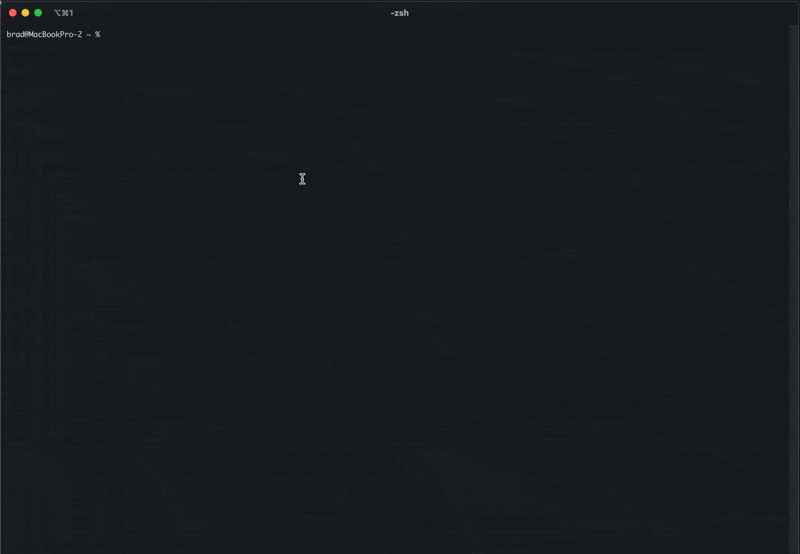

# Claude Code Log Viewer

Converts Claude Code JSONL log files into interactive HTML.



## Installation

Requires Go 1.21 or later. Install Go from https://go.dev/

```bash
git clone https://github.com/brads3290/cclogviewer
cd cclogviewer
make build
```

Or install directly:
```bash
go install github.com/brads3290/cclogviewer/cmd/cclogviewer@latest
```

## Usage

```bash
# Quick view (auto-opens in browser)
cclogviewer -input session.jsonl

# Save to file
cclogviewer -input session.jsonl -output conversation.html

# Save and open
cclogviewer -input session.jsonl -output conversation.html -open
```

## Arguments

- `-input`: JSONL log file path (required)
- `-output`: HTML output path (optional, auto-generates temp file if omitted)
- `-open`: Open in browser (automatic without -output)
- `-debug`: Enable debug logging

## Features

- Hierarchical conversation display
- Expandable tool calls and results
- Nested Task tool conversations
- Token usage tracking
- Syntax-highlighted code blocks
- Timestamps and role indicators

## Building from Source

```bash
make build           # Build binary
make test           # Run tests
make install        # Install to /usr/local/bin
```

See Makefile for all available commands.